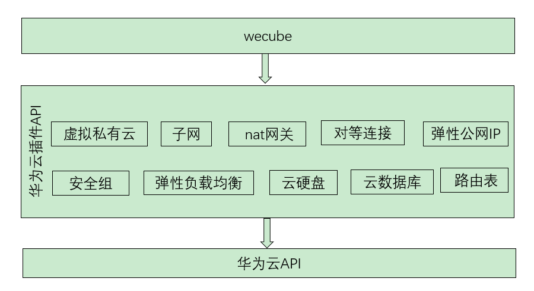

# HuaweiCloud插件
[](https://opensource.org/licenses/Apache-2.0)


## 简介

HuaweiCloud插件对华为云原生资源(如ECS、ELB、EIP、NAT网关、安全组等)的生命周期管理接口进行业务封装，提供符合Wecube插件规范的插件接口.

## HuaweiCloud插件的使用场景

在Wecube中注册该插件，即可通过Wecube的编排调用该插件的接口。插件支持的Huawei云资源如下图所示：



## HuaweiCloud插件开发环境搭建

详情请查看[HuaweiCloud插件开发环境搭建指引](docs/wecube-plugins-huaweicloud_build_dev_env.md)

开发环境搭建完成后，如果是linux用户，执行go build命令后，在当前目录下可看到wecube-plugins-huaweicloud的二进制程序，执行如下命令启动该程序,该程序启动后的默认端口为8083

```
./wecube-plugins-huaweicloud
```

程序启动后，可通过curl命令创建vpc来验证，命令如下其中your_access_key、your_secret_key、your_domain_id和your_project_id需要替换为用户自己华为云的对应参数。

```
curl -X POST \
  http://119.28.98.80:8083/huaweicloud/v1/vpc/create \
  -H 'cache-control: no-cache' \
  -H 'content-type: application/json' \
  -d '{
	"inputs":[
		{
		"identity_params":"AccessKey={$your_access_key};SecretKey={$your_secret_key};DomainId={$your_domain_id}",
		 "cloud_params":"CloudApiDomainName=myhuaweicloud.com;ProjectId={$your_project_id};Region=cn-south-1",
		"guid": "1234",
		"name": "VPC-C",
		"cidr": "xxx.xxx.xxx.xxx/16"
		}
	]
}


```

如果看到如下返回，表示创建vpc成功

```
{
    "result_code": "0",
    "result_message": "success",
    "results": {
        "outputs": [
            {
                "errorCode": "0",
                "errorMessage": "",
                "guid": "1234",
                "id":"209e670a-95e2-4e73-81f8-7f931e5847a1"
            }
        ]
    }
}
```


## HuaweiCloud编译和插件包制作
详情请查看[HuaweiCloud插件包编译和制作指引](docs/wecube-plugins-huaweicloud_compile_guide.md)


## 独立运行HuaweiCloud插件
HuaweiCloud插件包编译为docker镜像后，执行如下命令运行插件，其中IMAGE_TAG需要替换为HuaweiCloud插件docker镜像的tag

```
docker run -d -p 8083:8083 --restart=unless-stopped -v /etc/localtime:/etc/localtime  wecube-plugins-huaweicloud:{$IMAGE_TAG}
```


## API使用说明
关于HuaweiCloud插件的API使用说明，请查看文档
[HuaweiCloud插件API手册](docs/wecube_plugins_huaweicloud_api_guide.md)


## License
QCloud插件是基于 Apache License 2.0 协议， 详情请参考[LICENSE](LICENSE)


## 社区
- 如果您想得到最快的响应，请给我们提[Issue](https://github.com/WeBankPartners/wecube-plugins-qcloud/issues/new/choose)或扫描下面的二维码，我们会第一时间反馈。

	<div align="left">
	
	</div>


- 联系我们：fintech@webank.com
