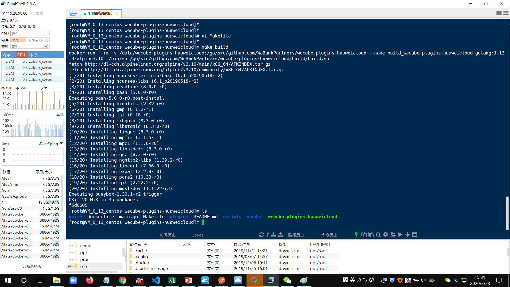
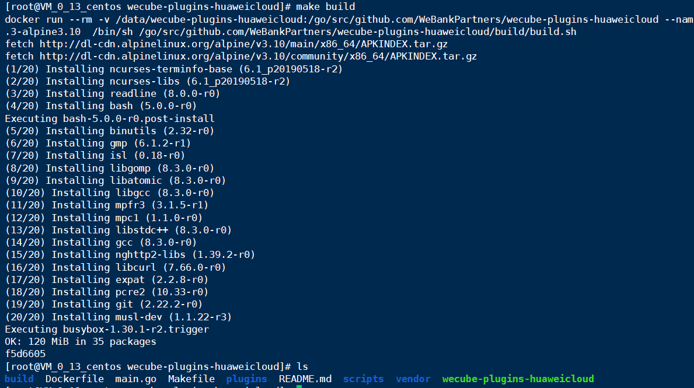
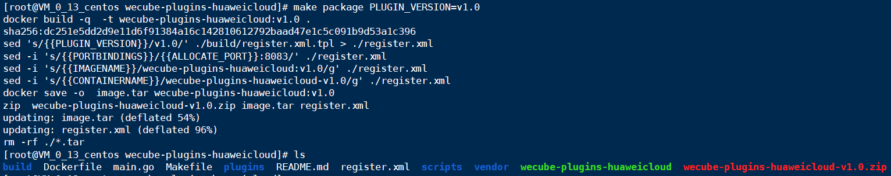

# WeCube Plugins HuaweiCloud Compile Guide

## 编译前准备
1. 准备一台linux主机，为加快编译速度， 资源配置建议4核8GB或以上；
2. 操作系统版本建议为ubuntu16.04以上或centos7.3以上；
3. 网络需要可通外网(需从外网下载安装软件)；
4. 安装Git
	- yum安装 
	```
 	yum install -y git
 	```
	- 手动安装，请参考[git安装文档](https://github.com/WeBankPartners/we-cmdb/blob/master/cmdb-wiki/docs/install/git_install_guide.md)

5. 安装docker1.17.03.x以上
	- 安装请参考[docker安装文档](https://github.com/WeBankPartners/we-cmdb/blob/master/cmdb-wiki/docs/install/docker_install_guide.md)


## 编译及打包
1. 通过github拉取代码
	
	切换到本地仓库目录， 执行命令：
	
	```
	cd /data
	git clone https://github.com/WeBankPartners/wecube-plugins-huaweicloud.git
	```

	根据提示输入github账号密码， 即可拉取代码到本地。
	拉取完成后， 可以在本地目录上看到wecube-plugins-huaweicloud目录， 进入目录，结构如下：
	
	

2. 编译和打包插件

	执行以下命令将生成插件包的二进制程序
	
	```
	make build
	```
	
	


	执行以下命令，将生成wecube使用的插件包：
	```
	make package PLUGIN_VERSION=v1.0
	```

	其中PLUGIN_VERSION为插件包的版本号，编译完成后将生成一个zip的插件包。

	